# Midas-Fingold

## Visão Geral

### 👥 Equipe: Bernardo Marques, Felipe Zanola, Otavio Goularti Barreto Silva, Matheus Gonçalves e Victor de Souza Santos.

### Descrição
O Midas FinGold é uma fintech inovadora para gestão financeira, permitindo que você controle seus ganhos, gastos, metas e investimentos de maneira eficiente. Além disso, oferece um calendário interativo que facilita a comparação entre ganhos e gastos, permitindo visualizar seu nível de satisfação diário.

### Recursos
Cadastro e Edição: No site, você pode cadastrar, editar e excluir ganhos, gastos, metas e investimentos. Gráficos Informativos: Visualize gráficos com informações sobre esses tópicos na tela principal. Calendário Interativo: Compare ganhos e gastos diários, verificando se ficou positivo ou negativo. Aba de Objetivos: Acompanhe o progresso das metas e marque-as como conquistadas. Aba de Investimentos: Receba indicações relacionadas ao seu perfil definido na aba de perfil e cadastre investimentos.

### Origem do Nome
O nome Midas é uma sigla para Management , income, dynamic and services. Gestão, renda, dinâmica e serviços, itens essenciais no nosso produto. Além disso, o rei Midas da mitologia grega transformava tudo o que tocava em ouro, simbolizando riqueza e valor. Assim, nosso site busca trazer prosperidade financeira aos usuários. 💰✨

## Telas do Projeto

Abaixo, você encontrará as telas do projeto, cada uma com uma breve descrição do seu propósito e funcionalidade:

### 1. Cadastro
  
  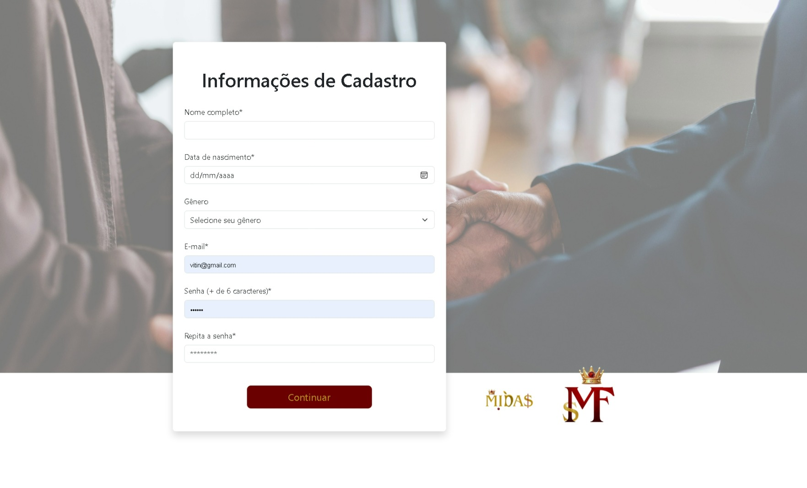

  * **Descrição:** Tela onde novos usuários podem se cadastrar na plataforma. É necessário preencher informações como nome, data de nascimento, gênero, email e senha.

### 2. Login
  
  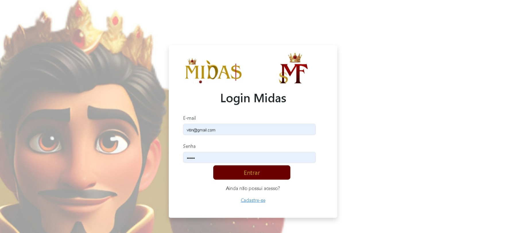

  * **Descrição:** Tela para usuários já cadastrados fazerem login na plataforma, usando email e senha. Há também um link para a tela de cadastro para quem ainda não possui conta.

### 3. Landing Page

  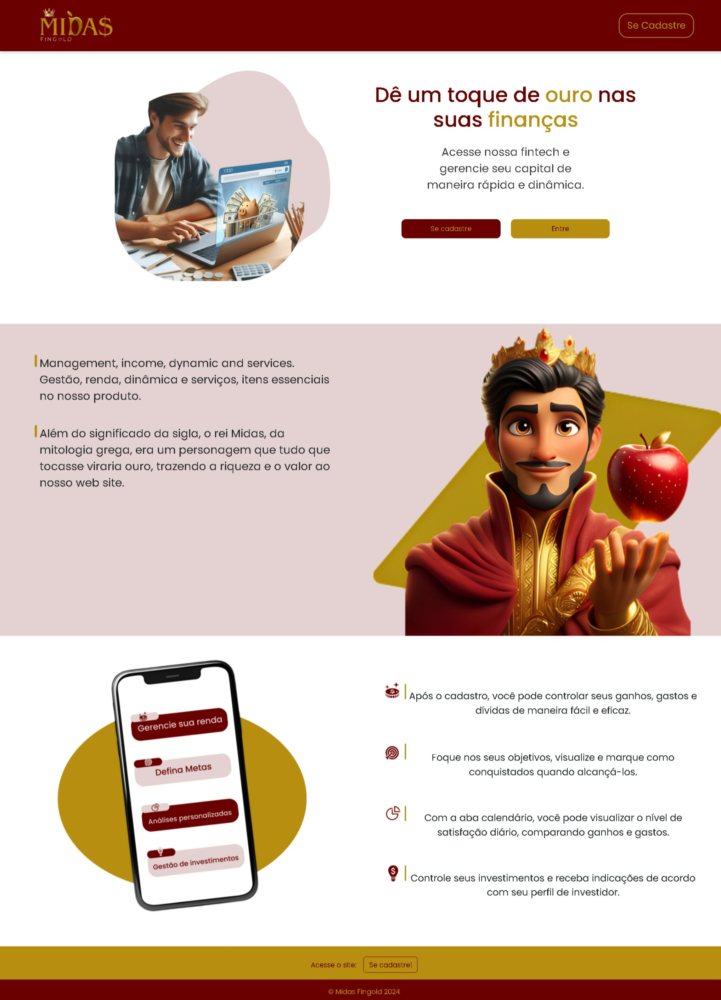

  * **Descrição:** A página inicial do site, onde os usuários são introduzidos à plataforma e suas funcionalidades. Apresenta um breve resumo dos benefícios e um convite para se cadastrar ou entrar na conta.

### 4. Dashboard

  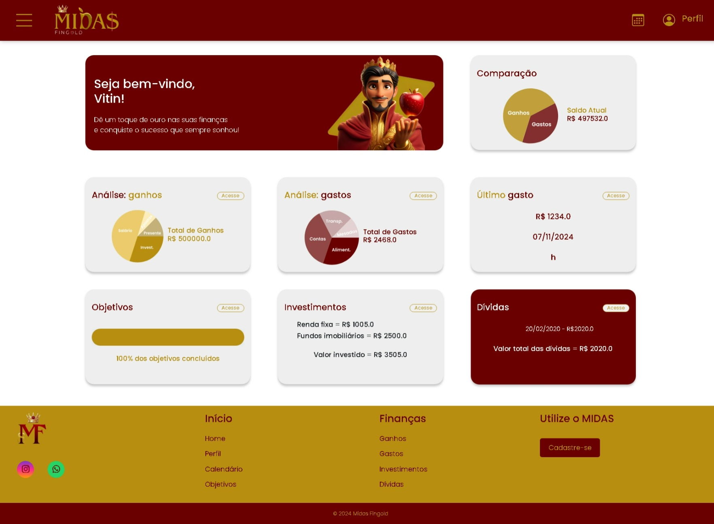
  
  * **Descrição:** A tela principal após o login, onde o usuário tem uma visão geral de suas finanças. É possível ver um resumo de ganhos, gastos, um último gasto registrado, objetivos, investimentos e dívidas.

### 5. Ganhos

  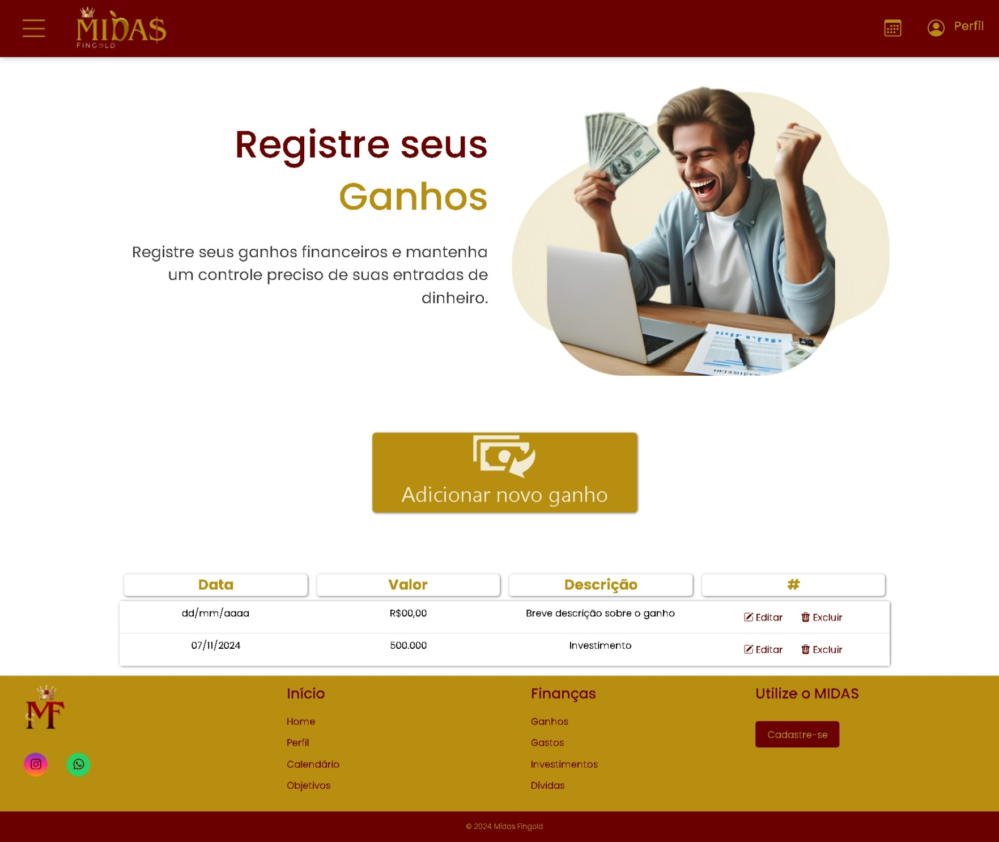
  
  * **Descrição:** Tela para registrar e acompanhar todos os ganhos financeiros. Os usuários podem adicionar novos ganhos, editar ou excluir os existentes.

### 6. Gastos

  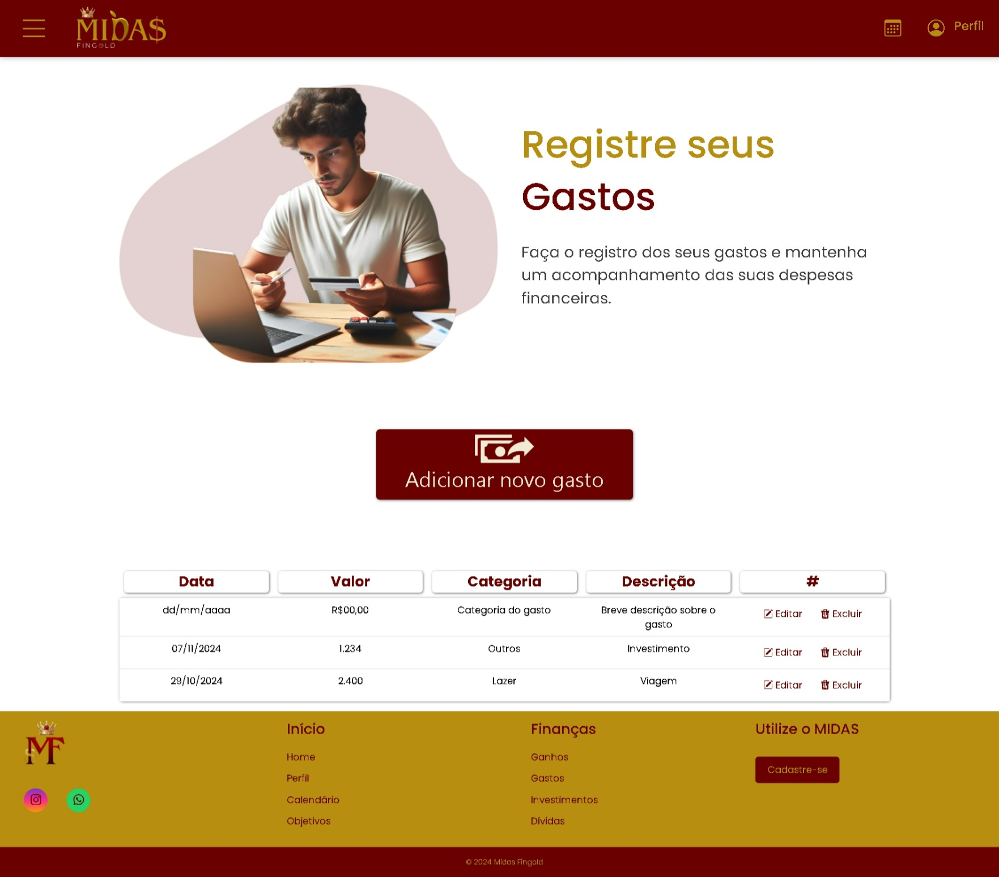
  
  * **Descrição:** Tela para registrar e acompanhar os gastos. Permite adicionar novos gastos, categorizá-los e gerenciar as despesas.

### 7. Objetivos

  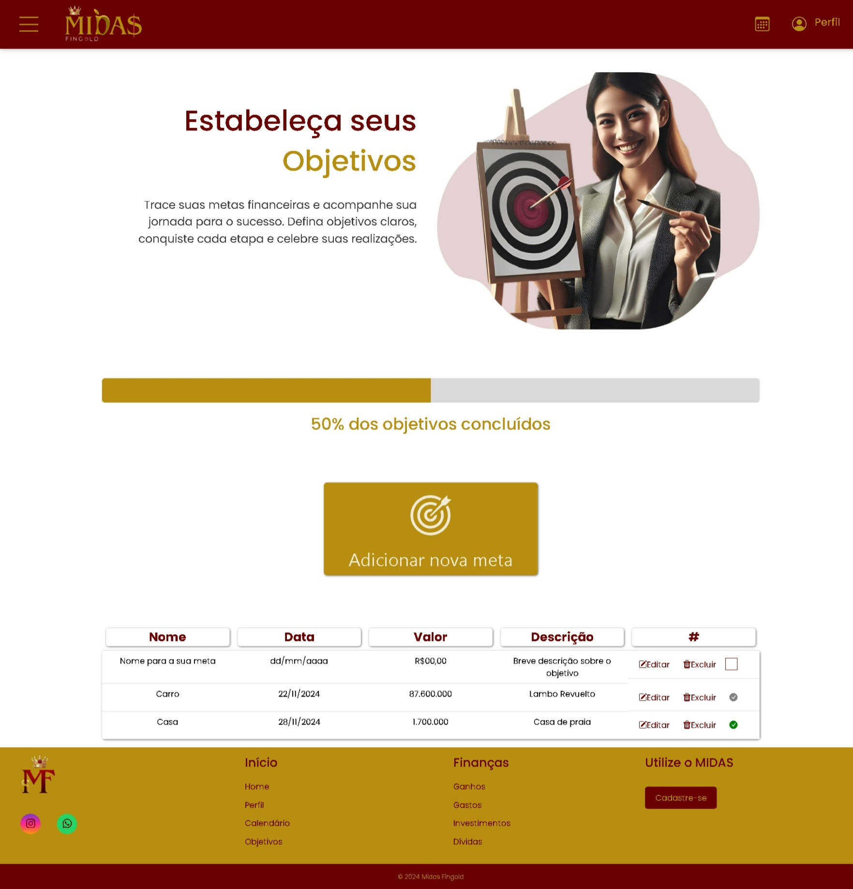
  
  * **Descrição:** Tela para o usuário definir e acompanhar seus objetivos financeiros. Permite criar novas metas, acompanhar o progresso e celebrar as conquistas.

### 8. Investimentos
  
  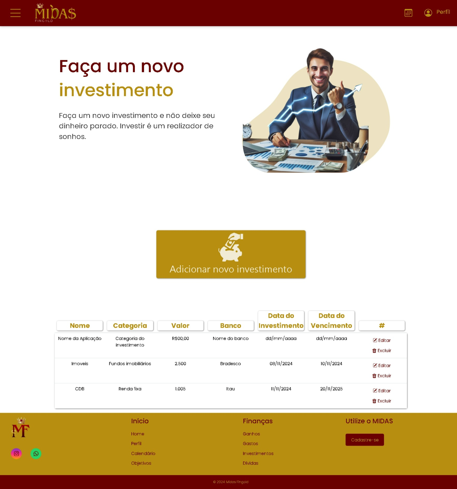

  * **Descrição:** Tela para registrar e acompanhar os investimentos. Os usuários podem adicionar novos investimentos, visualizar os detalhes e monitorar o desempenho.

### 9. Dívidas

  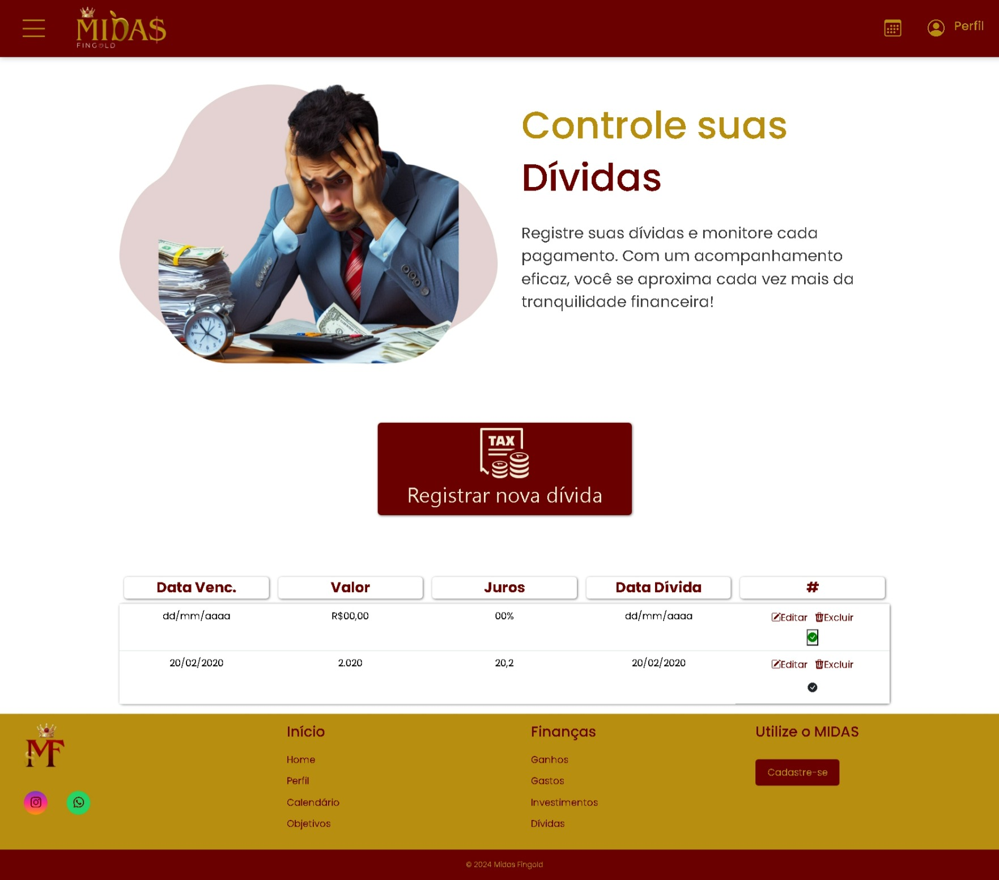
  
  * **Descrição:** Tela para registrar e acompanhar as dívidas. É possível adicionar novas dívidas, definir prazos e monitorar os pagamentos.

### 10. Calendário

  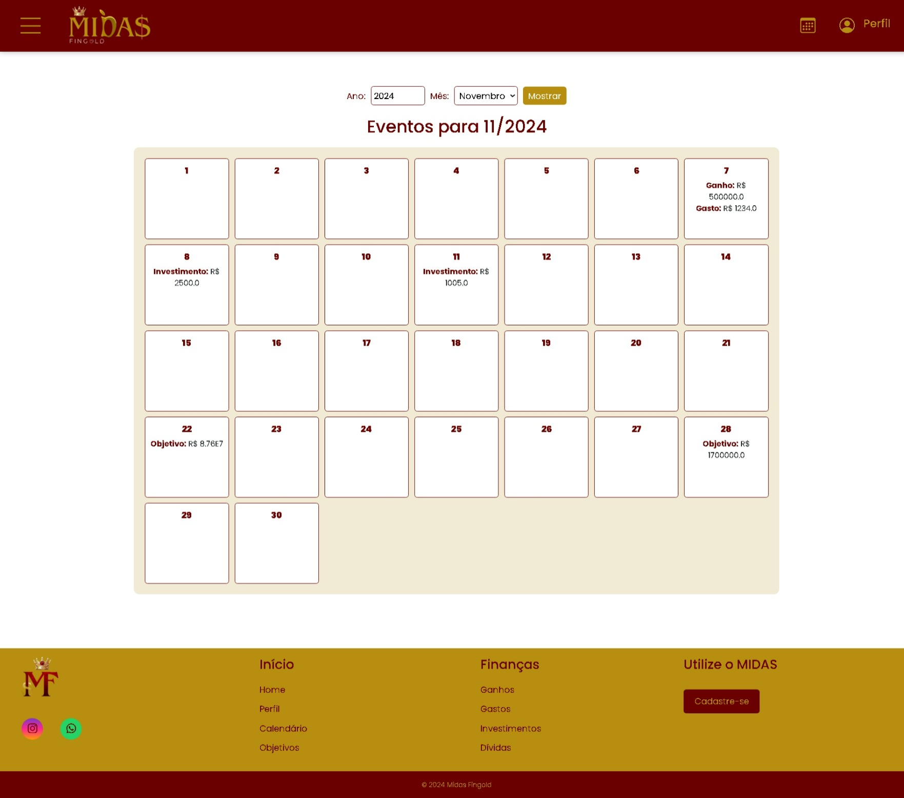
  
  * **Descrição:** Tela com um calendário para visualizar eventos e compromissos financeiros ao longo do mês. Facilita a organização das finanças.

### 11. Perfil

  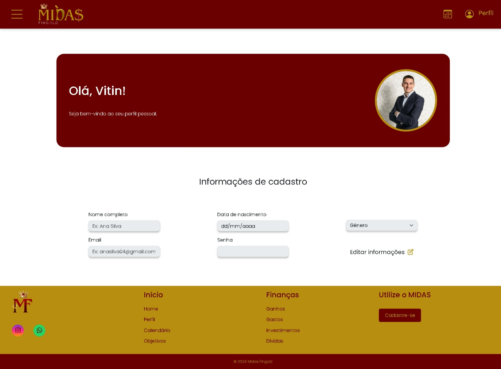
  
  * **Descrição:** Tela de perfil do usuário, onde é possível visualizar e editar informações pessoais, como nome, email, data de nascimento e senha.
